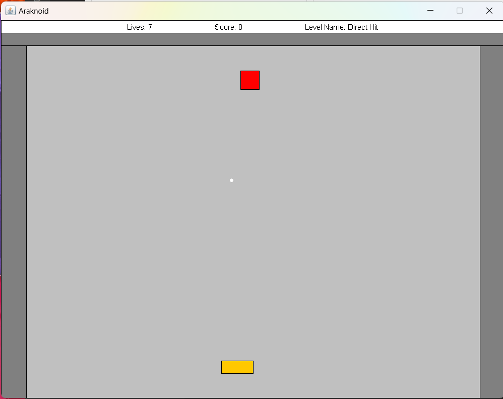
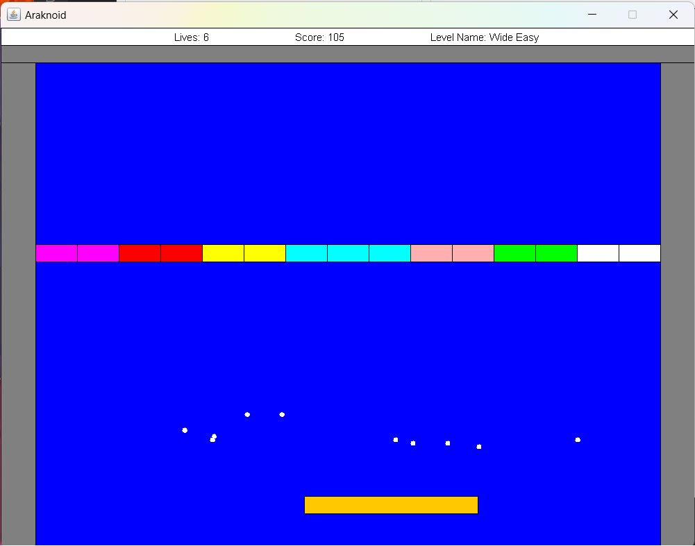
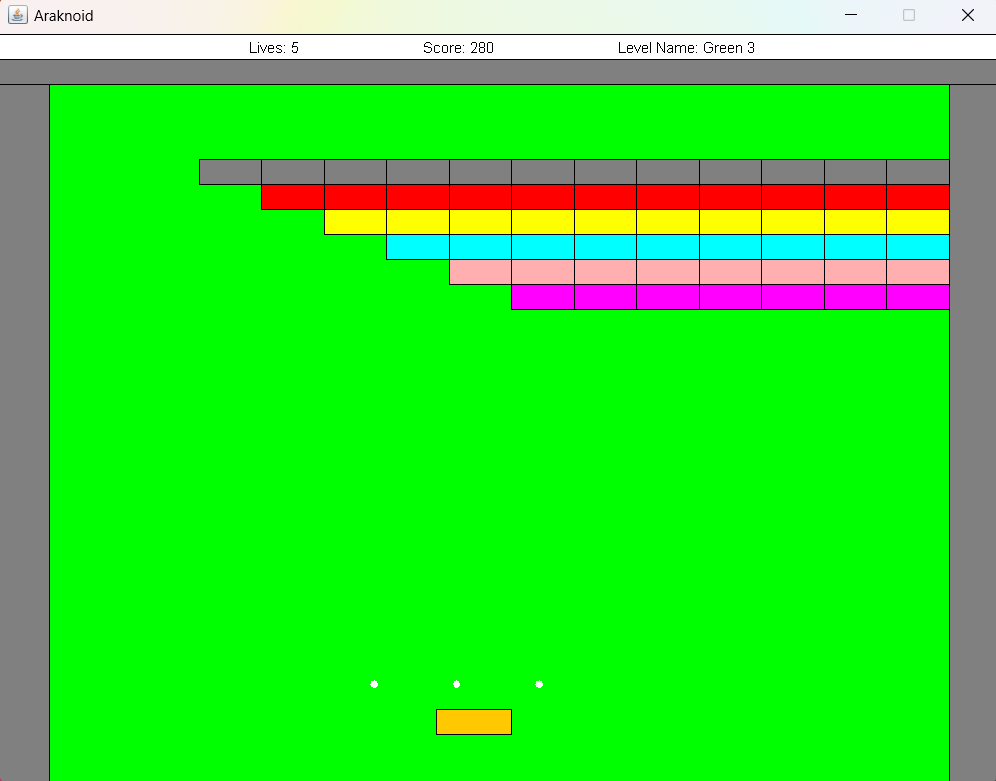
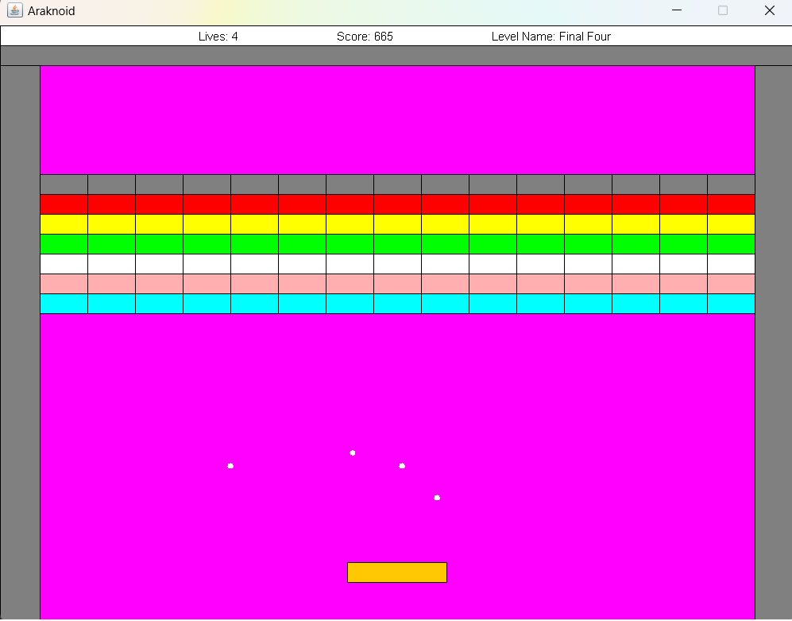

# Araknoid-Game
This repository contains the files for an "Araknoid" style game.
**Compiling and running the program** - assuming you have Java Developement installed and apache ant installed, to compile and run the program, execute the terminal command `ant run` in the directory of the project.  

## Intrduction  
The game includes four levels. In each level, the paddle size and speed and number of balls differ such that the difficuty is harder in each sequential level.  
in order to beat each level, the player must break all of the blocks with the balls.

## Key Learnings
By developing this project, i have gained experience in the following areas:  
- *OOP* principles such as **encapsulation** and **polymorphism** (using inheritance and interfaces).
- GUI design
- Implementing Listener / Observer Design Pattern.

#### The first level 

#### The second level

#### The third level

#### The fourth level

